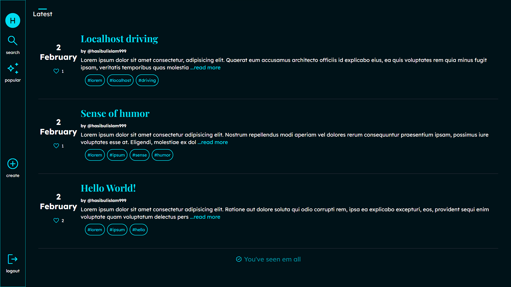
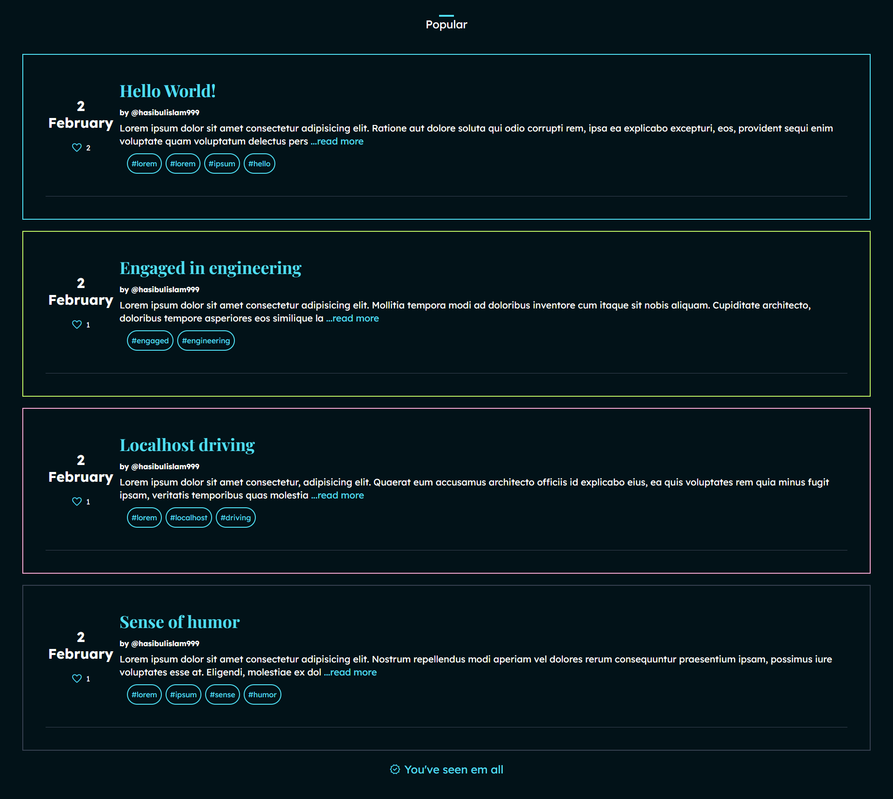
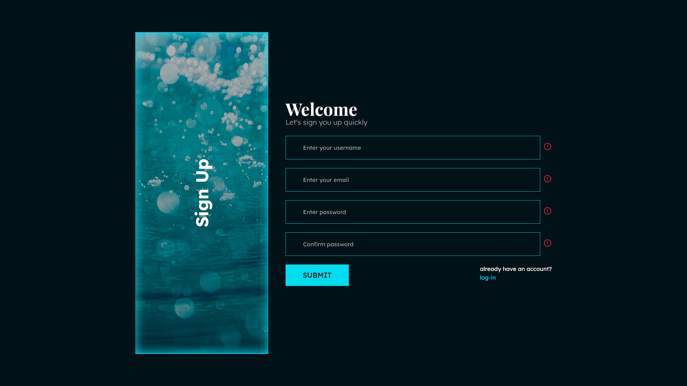

# nLog

> _Natural Way Of Blogging. By writing politically incorrect things uwu._ Welcome to our cozy corner of the internet! Explore a delightful mix of lighthearted musings, everyday adventures, and insightful reflections on our non-political blog. Join us in celebrating life's simple joys and finding inspiration in the ordinary. Come, unwind, and discover the beauty in simplicity!

## Overview





## Features

- [x] Sign up
- [x] Sign in
- [x] Create Post
- [x] Search Post
- [x] Static Sidebar
- [x] Static Bottom bar
- [x] Responsive Design
- [x] Deployment

## Tech Stack

- Framework: `React.Js 18`
- Styling: `Tailwind CSS`
- Database: `MongoDB`
- ORM: `Mongoose`
- Linting: `ESLint`
- Formatter: `Prettier`
- Backend Directory: `Node.Js Express Server`

## Technologies

### Built using ( MERN STACK )


| Client                       | Server             |
| ---------------------------- | ------------------ |
| tailwind css                 | nodemon            |
| @testing-library/jest-dom    | @hapi/joi          |
| @testing-library/react       | bcrypt             |
| @testing-library/user-event  | cookie-parser      |
| axios                        | cors               |
| dayjs                        | dotenv             |
| lodash                       | express            |
| react                        | express-paginate   |
| react-bottom-scroll-listener | express-rate-limit |
| react-dom                    | jsonwebtoken       |
| react-router-dom             | mongo-sanitize     |
| react-scripts                | mongoose           |
| util                         | morgan             |
| web-vitals                   | nodemon            |

# Development

## Clone Repository

> Run `Client-Side` First then Run `Server-Side` Last

```bash
git clone https://github.com/devhasibulislam/nLog-blogs.git
cd nLog
cd client
yarn

cd ..

cd server
yarn
cd ..
```

# Important Links

[x] Client Side - [Click Here](https://nlog-blogs-csr.vercel.app/)
[x] Server Side - [Click Here](https://nlog-blogs-ssr.vercel.app/)
[x] Figma Template - [Click Here](https://www.figma.com/community/file/1118764549305878223)

# Author

Hasibul Islam - [Portfolio](https://devhasibulislam.vercel.app)

## Try Login `Demo Users`

- Hasib: `devhasibulislam@gmail.com` or `Hasib123`
- Sadia: `devsadiakhan@gmail.com` or `Sadia123`

# How to deploy the app on VPS (Virtual Private Server) ?

`I recommend the following tutorials`

- https://www.youtube.com/watch?v=Nxw2j1-srVc
- https://github.com/safak/youtube/tree/mern-deployment
